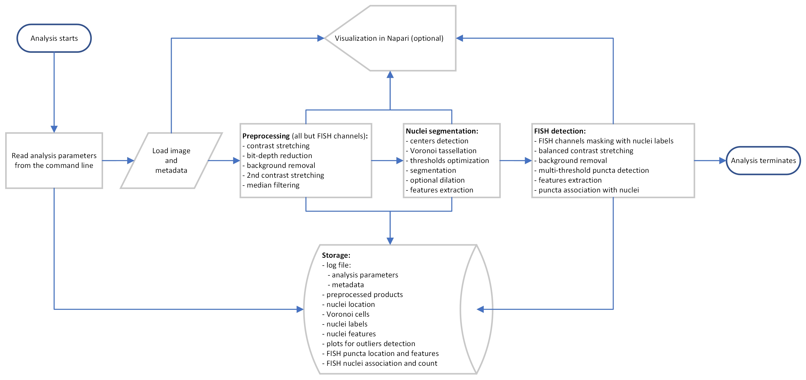

# FlySeg

## 1. Setting up the conda environment

FlySeg is a Python-based package. The installation can be done by installing all the required dependencies manually or by using the provided file environment file issuing the command: `conda env create -f environment.yml`. Once the environment has been created, it should be activated with conda `activate flyseg` before starting the analysis.

### 1.1 Hardware requirements

The size of the images to analyze and the analysis parameters will determine the hardware requirements.

## 2. Usage

Within the conda environment, the program can be started with the default values using the command: `python main.py [options]`.

A schematic of the workflow is shown in the image below.


For additional information refer to:

> Mirshahidi, P., Frighetto, G., Orth, J., Vaccari, A., Dombrovski, M. Expansion-Assisted Hybridization Chain Reaction-smFISH and Immunohistochemistry in Drosophila Brain. *[J. Vis. Exp.](https://www.jove.com)* (232), e71400, doi:[10.3791/71400](https://doi.org/10.3791/71400) (2026).

### 2.1 Options

The package provides multiple options for the analysis in addition to the optional visualization of the intermediate and final products using the Napari viewer. Within the conda environment is possible to visualize the list of the available analysis options, and their default values, using the following command: `python main.py --help.
options`:

```ascii
  -h, --help            show this help message and exit
  --file FILE           CZI or NPY file to analyze. If not specified, the user will be asked
                        to select a file.
  --metadata_only       Only retrieve and display the metadata of the CZI file. (Default:
                        False)
  --visualize           Display analysis results using napari. (Default: False)
  --visualize_only      Only display the original data using napari. Implies '--visualize'.
                        (Default: False)
  --resolution RESOLUTION RESOLUTION RESOLUTION
                        Override the z y x resolution for the voxels. If not specified the
                        values will be extracted from the image, if available. If not it will
                        default to 1 1 1. (Pass as 3 space-separated values).
  --channels CHANNELS   Specify the number of channels inside the image. If 1, it is assumed
                        that only the nuclei channel is present. (Default: 4)
  --nuclei_sigma_range NUCLEI_SIGMA_RANGE NUCLEI_SIGMA_RANGE NUCLEI_SIGMA_RANGE
                        Range min max steps to use as LOG sigmas for the nuclei detection.
                        (Default: 10 25 3. Pass as 3 space-separated values).
  --nuclei_threshold NUCLEI_THRESHOLD
                        Threshold to use in LOG for the nuclei detection. (Default: 20)
  --nuclei_dilation NUCLEI_DILATION
                        Fraction (of radius) dilation to apply to the individual nuclei labels
                        after segmentation. The remaining analysis will be based on the
                        dilated nuclei. (Default: 0, no dilation)
  --fish_contrast_range FISH_CONTRAST_RANGE FISH_CONTRAST_RANGE
                        Range min max to use for the initial FISH raw data contrast
                        stretching. If not specified, the values will be extracted from each
                        channel. (Pass as 2 space-separated values).
  --fish_threshold_range FISH_THRESHOLD_RANGE FISH_THRESHOLD_RANGE FISH_THRESHOLD_RANGE
                        Range min max steps to use for the thresholds used to detect FISH
                        signatures. (Default: 2 10.5 0.5. Pass as 3 space-separated values).
  --no_fish             Don't perform the FISH detection. (Default: False)
  --regenerate_pre      Regenerate stored file associated with pre-processing. (Default:
                        False)
  --regenerate_nuclei   Regenerate stored file associated with nuclei detection. (Default:
                        False)
  --regenerate_fish     Regenerate stored file associated with FISH detection. (Default:
                        False)
  --regenerate_all      Regenerate all steps of the analysis. Equivalent to --regenerate_pre
                        --regenerate_nuclei --regenerate_fish. (Default: False)
  --output_dir OUTPUT_DIR
                        Directory where to look for and store the folder containing results
                        and auxiliary files. (Default: the same directory as the input file)
  --version             Show version number and exit.

Nuclei channel selection:
  If not None, --nuclei_wavelength takes precedence over --nuclei_ch.

  --nuclei_ch NUCLEI_CH
                        Specifies the channel number where the nuclei are imaged. (Default: 0)
  --nuclei_wavelength NUCLEI_WAVELENGTH
                        Specifies the wavelength of the channel where the nuclei are imaged.
                        (Default: None)

Cytoplasm channel selection:
  If not None, --cytoplasm_wavelength takes precedence over --cytoplasm_ch.

  --cytoplasm_ch CYTOPLASM_CH
                        Specifies the channel number where the cytoplasm is imaged. Use `None`
                        if the cytoplasm is not imaged. (Default: 3)
  --cytoplasm_wavelength CYTOPLASM_WAVELENGTH
                        Specifies the wavelength of the channel where the cytoplasm is imaged.
                        (Default: None)
```

### 2.2 Recommended steps

1. Verify the metadata of the image using the `--metadata_only` option. This will provide information about size of the image (in voxels); number, Id, and wavelength of each channel; physical size corresponding to each voxel (units are the same as the units in the metadata); spacing ration (Z / X or Y), data type, and bit-depth (how many bits for each voxel). These data can be used to identify the channels corresponding to the nuclei and the cytoplasm (if imaged). 

2. Start the analysis (`python main.py`) with one or more of the options listed above to taylor the analysis to the image. Typically the following will need to be changed (see options above): number of channels (to match those available in the image – the default is 4), the nuclei channel (the default is 0), and the cytoplasm channel (the default is 3) if imaged. All the channels that are not identified as nuclei or cytoplasm will be considered FISH channels and analyzed accordingly. Also important is the definition of the `--nuclei_dilation` option. This option allows to expand the segmented nuclei by a certain percentage. This approach can be used to include part of the surrounding cytoplasm in the following analyses allowing the inclusion of FISH puncta detected in the cytoplasm surrounding the nucleus. The expansion preserves the overall shape of the segmented nucleus.

3. During the analysis the processing log, including the image metadata, the analysis parameters, and the processing steps, will be displayed on the screen while all the products will be saved in a folder named after the image being analyzed and created within the same folder where the image is located. To override the default location use the `--output_dir` described above. The processing log can be saved by redirecting the output to a file.

4. Analyze the _\<file\>-Nuclei-equivalent-diameter-area-scatter.png_ described below to identify potential outliers.

### 2.3 Outputs

The analysis will generate the outputs listed below, where _\<file\>_ represents the file name of the image being analyzed, and _\<channel\>_ can be either Nuclei, Cytoplasm, FISH_\<wavelength\> based on the channels available within the image.

***\<file\>-\<channel\>-den-gaus-(\<sigma\>).npy.lzma:*** a lzma compressed numpy array containing the result of applying a Gaussian with a standar deviation of _\<sigma\>_ (z, y, x size in voxels) to _\<channel\>_. This is used to remove potential slow spatial frequency changes in illumination.

***\<file\>-\<channel\>-den-median-(\<size\>).npy.lzma:*** a lzma compressed numpy array containing the output of a median filter of _\<size\>_ (z, y, x size in voxels) applied to _\<channel\>_ after the Gaussian evaluated above has been removed.

***\<file\>-Nuclei-blb-(\<sigma_start\>)-(\<sigma_end\>).npy.lzma:*** a lzma compressed numpy array containing an array of the detected nuclei’s centers using the Laplacian of Gaussians (LOG) filter with sigmas ranging from _\<sigma_start\>_ to _\<sigma_end\>_. The range of sigma, the number of steps, and the threshold value used by the LOG filter can be specified using the options `–-nuclei_sigma_range` and `--nuclei_threshold` described above.

***\<file\>-Volume-voronoi.npy.lzma:*** a lzma compressed numpy array containing the Voronoi tasselation based on the detected nuclei’s centers. The array has the same voxel size as the Nuclei’s channel.

***\<file\>-Nuclei-labels.npy.lzma:*** a lzma compressed numpy array containing the segmented nuclei where the voxels within the nuclei are labeled with values from 1 to the number of detected nuclei (the background voxels have value of 0). The array has the same size (in voxels) as the Nuclei’s channel.

***\<file\>-Nuclei-labels.tif:*** the TIFF version of _\<file\>-Nuclei-labels.npy.lzma_.

***\<file\>-Nuclei-df.csv:*** a comma separated value (CSV) file containg features extracted from each of the segmented nuclei using the  regionprops function of the scikit-image library (label, volume in voxels, axis_major_length, axis_minor_length, equivalent_diameter_area, slice, solidity) in addition a ‘keep’ label that identifies if that nucleus should be further processed.

***\<file\>-Nuclei-df.json:*** the same data as in _\<file\>-Nuclei-df.csv_ but in JSON format.

***\<file\>-Nuclei-equivalent-diameter-area-scatter.png:*** a plot showing equivalent-diameter-area-scatter vs label plot. The LOG filter used to identify the centers of potential nuclei assigns labels based on the average intensity of the detected nucleus, with lower label being assigned to higher luminosity nuclei. This results in nuclei with lower contrast having higher labels values. The lower the contrast, the higher the risk of under-segmentations. This plot, which also identified quartile ranges, can be used to identify outliers during subsequent analysis.

***\<file\>-\<channel\>-puncta-df-(\<start\>-\<stop\>-\<step\>).csv:*** a CSV file containing the list of the puncta identified using a LOG filter (with sigma ranging, in 7 steps, from 1.5 to 3 voxels). _\<start\>_, _\<stop\>_, and _\<step\>_ indicate the range of thresholds used for multiple iterations of the LOG filter (these values can be updated using the `--fish_threshold_range` option described above. For each punctum, the following qre collected: label, coordinates, optimal sigma used by the LOG filter, the label of the nucleus with whom they are associated, the list of the thresholds and the LOG filter for which the punctum was detected. Brighter puncta will be detected at multiple thresholds while dimmer one only at the lowest ones. This gives an option to filter the puncta in post-processing.

***\<file\>-\<channel\>-puncta-df-(\<start\>-\<stop\>-\<step\>).json:*** the same data as in _\<file\>-\<channel\>-df-(\<start\>-\<stop\>-\<step\>).csv_ but in JSON format.

***\<file\>-\<channel\>-puncta-props-df-(\<start\>-\<stop\>-\<step\>).csv:*** the same data as in _\<file\>-\<channel\>-df-(\<start\>-\<stop\>-\<step\>).csv_ but organized so that, for each nucleus identify by its label, it the count of the puncta associated with that nucleus and the list of their labels.

***\<file\>-\<channel\>-puncta-props-df-(\<start\>-\<stop\>-\<step\>).json:*** the same data as in _\<file\>-\<channel\>-puncta-props-df-(\<start\>-\<stop\>-\<step\>).csv_ but in JSON format.

***\<file\>-Nuclei-FISH-df-(\<start\>-\<stop\>-\<step\>).csv:*** this file provides a merge of the information from previous files. For each nucleus it lists all the feature data from _\<file\>-Nuclei-df.csv_ followed by the corresponding data from each of the available _\<file\>-\<channel\>-puncta-props-df-(\<start\>-\<stop\>-\<step\>).csv_ allowing for comparisons in counts when more than one FISH channel is available.
